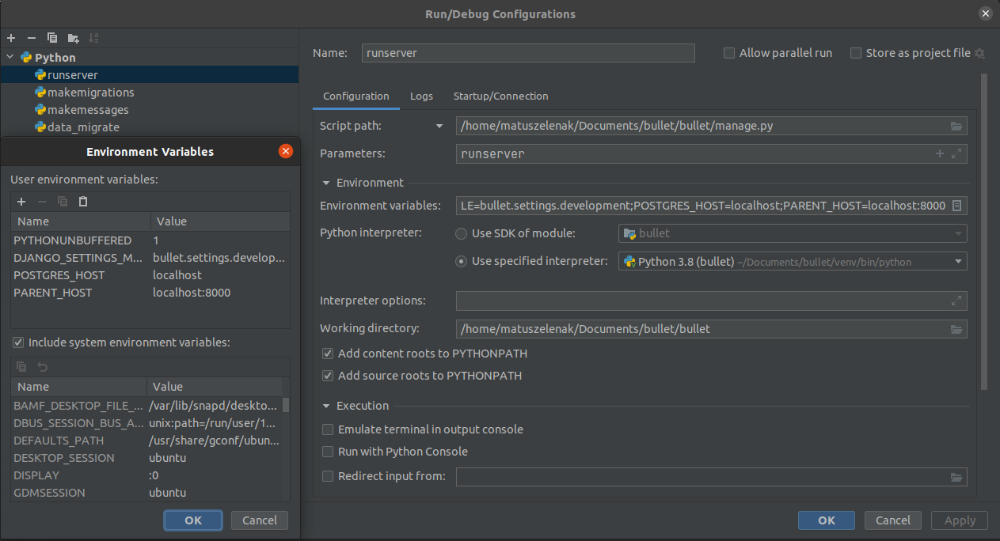

# bullet

Bullet is a successor to the web for Náboj competition.
Programmed in Python + Django with PostgreSQL.

### Prerequisites

To be able to run the project in docker:
- [Docker](https://docs.docker.com/engine/install/)
- [docker-compose](https://docs.docker.com/compose/install/)

If you want to run the project outside of docker:
- For the django web server you will need:
  - [Python 3.9 with Pip](https://www.python.org/downloads/)
- For the database client:
  - PostgreSQL client

### Recommendations

For development, PyCharm is probably the best option for an IDE. Ultimate edition also has Django support, 
and students can get that one for free. IntelliJ IDEA can also be setup with Python SDK.

### Running the project locally

Download the repository and enter the folder:

``git clone git@github.com:naboj-org/bullet.git && cd bullet``

#### Docker:

``docker-compose up``

#### Not-Docker:

You will have to manually create a postgres database `bullet` and a user `bullet` with password `bullet` with all privileges granted on this database.

Google is your friend here.

Create a virtualenv if you don't have one
``python3 -m venv venv``
Or you can create one through Pycharm/IDEA IDE.
Activate it by running

```source venv/bin/activate``` on Linux systems

```venv/Scripts/activate``` on Windows

If you created it through the IDE, it will automatically be activated in the embedded console.

Install Python dependencies
``pip install -r requirements.txt``

Or again, PyCharm/IDEA will offer an option of installing the dependencies on the opened requirements.txt file.

In order for code completion to work properly in JetBrains IDEs, you should set the inner `bullet` folder as a source folder in the project settings.

In order for branch subdomains to properly work, you need to add the following entry to your `/etc/hosts` file (on Linux)

```127.0.0.1	localhost *.localhost```
For Windows, the process is described [here](https://gist.github.com/zenorocha/18b10a14b2deb214dc4ce43a2d2e2992)

At this point, you should be able to run the development server on linux using

```DJANGO_SETTINGS_MODULE=bullet.settings.development python3 manage.py runserver```

On Windows, you will first have to set the `DJANGO_SETTINGS_MODULE` environment variable manually.

Navigating to `math.localhost:8000` in your browser should bring up the page.

It is however recommended running the development server from the IDE using a run configuration where environment variables can be defined directly
Example configuration:

This will spare you the need to prefix the runserver command with env variables/setting them in Windows
